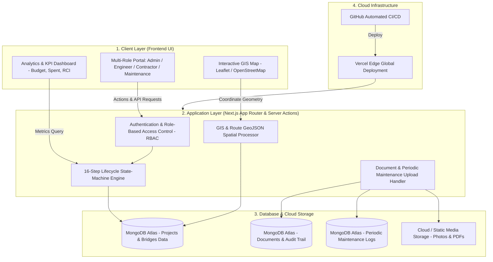

# 🛣️ InfraTrack GIS — Next-Gen Infrastructure Lifecycle & Spatial Asset Governance

[](https://nextjs.org/)
[](https://www.mongodb.com/cloud/atlas)
[](https://leafletjs.com/)
[](https://vercel.com/)
[](https://opensource.org/licenses/MIT)

**InfraTrack GIS (Pravi Hackathon)** is an enterprise-grade, end-to-end digital governance platform designed for public works departments, national highways authorities, municipal corporations, and engineering agencies. It modernizes the tracking, planning, execution, quality control, GIS spatial analysis, and post-construction maintenance of **Roads, Bridges, and Public Buildings**.

---

## 📑 Table of Contents
1. [Key Highlights & Capabilities](#-key-highlights--capabilities)
2. [High-Level System Architecture (HLD)](#-high-level-system-architecture-hld)
3. [16-Step Digital Lifecycle Workflow](#-16-step-digital-lifecycle-workflow)
4. [Multi-Department Roles & RBAC](#-multi-department-roles--rbac)
5. [Core Modules & Features](#-core-modules--features)
6. [Tech Stack & Tooling](#-tech-stack--tooling)
7. [Getting Started & Installation](#-getting-started--installation)
8. [Environment Configuration & Deployment](#-environment-configuration--deployment)

---

## 🌟 Key Highlights & Capabilities

- 🗺️ **Full-Featured GIS Mapping**: Interactive route polyline drawing, geo-fenced coordinates, landmark plotting, and spatial road condition heatmap overlays.
- ⚡ **16-Stage State-Machine Lifecycle**: Rigorous gatekeeper workflow moving assets from initial citizen request to post-construction warranty maintenance.
- 👥 **Dynamic Department Team Allocation**: Teams are dynamically unveiled at each milestone step as specific stakeholders take action.
- 🛠️ **Post-Construction Periodic Maintenance Hub**: Dedicated maintenance portal for **6-Month, 1-Year, 2-Year, 3-Year, and 5-Year** periodic structural audits, condition index updates (RCI/Score), defect photo proof, and engineering inspection reports.
- 💰 **Real-Time Financial & Budget Governance**: Live calculation of total sanctioned budget, funds disbursed, remaining balance, and contractor measurement books (MB).
- 🏗️ **Multi-Asset Support**: Custom-tailored metadata and inspection metrics for **Roads (KM & RCI)**, **Bridges (Spans, Waterbody & Scour)**, and **Buildings (Floors & Area)**.

---

## 🏛️ High-Level System Architecture (HLD)



---

## 🔄 16-Step Digital Lifecycle Workflow

Every infrastructure project moves sequentially through a 16-step approval and execution workflow:

| Step # | Stage Name | Responsible Role | Mandatory Artifact / Action |
| :---: | :--- | :--- | :--- |
| **1** | **Report Issue / Request** | System Administrator (`admin`) | Project creation, asset category, budget estimation |
| **2** | **Engineering Field Report & Proposal** | Engineering Lead (`engineer`) | Field inspection notes, technical feasibility report |
| **3** | **GIS Mapping & Spatial Analysis** | GIS Surveyor (`surveyor`) | Interactive route coordinates, road geometry, map alignment |
| **4** | **DPR Consultant Detailed Reports** | DPR Consultant (`dpr`) | Soil assessment, traffic count analysis, DPR PDF |
| **5** | **Planning & Utility Clearances** | Planning Authority (`planning`) | Land acquisition, environmental & utility NOCs |
| **6** | **Asset Manager Pre-Approval** | Asset Manager (`asset_mgr`) | Asset registry impact check, asset code tag |
| **7** | **Financial Sanction** | Finance Officer (`finance`) | Budget allocation, financial sanction order |
| **8** | **Administrative Prioritisation** | Approving Authority (`admin_approver`) | High-priority gazette sanction & executive sign-off |
| **9** | **Tender & Contract Award** | Procurement Officer (`procurement`) | Tender floating, bidder evaluation, Letter of Acceptance (LOA) |
| **10** | **Execution Setup** | Contractor Agency (`contractor`) | Site mobilisation, safety plan, work order acknowledgement |
| **11** | **Construction Monitoring** | Contractor Agency (`contractor`) | Measurement Book (MB) entries, daily physical progress % |
| **12** | **Contractor Work Completion** | Contractor Agency (`contractor`) | As-built completion certificate, final site photography |
| **13** | **Quality Control Verification** | QC Engineer / Lab (`qc`) | Core compression test, bitumen density, QC clearance certificate |
| **14** | **Measurement & Billing** | Accounts / Finance (`accounts`, `finance`) | Final invoice settlement, contractor retention payment |
| **15** | **Asset Registry Update** | GIS Team / Asset Manager (`asset_mgr`, `surveyor`) | Final geo-tagging, official state asset ledger incorporation |
| **16** | **Post-Construction Maintenance** | Maintenance Agency (`maintenance`) | **6M / 1Y / 2Y / 3Y / 5Y** inspections, defect photos, RCI updates |

---

## 👥 Multi-Department Roles & RBAC

The system provides complete separation of duties via an interactive role switcher:

- **Admin (System Administrator)**: Master dashboard view, create projects, manage system config.
- **Engineering Lead**: Technical estimates, slope/pavement designs, field inspection.
- **GIS Surveyor**: OpenStreetMap integration, geo-coordinate digitizer, polyline route generation.
- **DPR Consultant**: Detailed Project Reports, geotechnical and traffic capacity studies.
- **Planning & Clearances**: Right-of-Way (RoW), environmental clearances, tree-cutting/utility NOCs.
- **Asset Manager**: Central registry of state roads, bridges, culverts, and buildings.
- **Finance & Accounts**: Sanctioning budget allocations, financial progress burn down, invoice release.
- **Procurement / Tender Cell**: EPC tender creation, contractor qualification, LOA issuance.
- **Contractor**: Physical execution progress, milestone proof uploads, daily logs.
- **Quality Control (QC)**: Lab tests, pavement deflection, concrete grade verification.
- **Maintenance & Operations**: Periodic defect remediation, crack/pothole audits, condition grading.

---

## 💻 Core Modules & Features

### 1. 📊 Executive Analytics Dashboard
- Live counters for Total Projects, Under Construction, System Budget, and Critical Roads ($RCI < 40$).
- Budget vs. Expenditure financial comparison charts.
- Road Condition Index (RCI) breakdown: Good ($\ge 80$), Fair ($50-79$), Critical ($< 50$).

### 2. 🗺️ GIS Spatial Mapping Engine
- OpenStreetMap and satellite layer toggling.
- Dynamic color coding of road segments based on Road Condition Index (Green = Excellent, Yellow = Moderate, Red = Distressed).
- Clickable pins with instant project cards showing financial spend, progress, and team leads.

### 3. 🛠️ Periodic Maintenance History Timeline
- Dedicated records array preserving all historical audits over the 5-year lifecycle.
- Color-coded condition score tracking over time.
- Integrated photo gallery and downloadable audit PDF documents.

### 4. 📁 Secure Document Vault
- Timestamped audit trail of all sanction orders, DPRs, LOAs, Measurement Books, and QC lab reports.

---

## 🛠️ Tech Stack & Tooling

- **Frontend**: Next.js 15 (App Router), React 19, Lucide Icons, Tailwind CSS & Vanilla CSS Design Tokens
- **Mapping & Spatial**: Leaflet.js, React-Leaflet, OpenStreetMap Tile Services
- **Backend & APIs**: Next.js Server Actions, Node.js
- **Database**: MongoDB Atlas (Cloud NoSQL Database)
- **Deployment**: Vercel Serverless Edge Platform
- **Version Control**: Git & GitHub

---

## 🚀 Getting Started & Installation

### Prerequisites
- Node.js (v18.0.0 or higher)
- npm, yarn, or pnpm
- MongoDB Atlas account (or local MongoDB server)

### 1. Clone the Repository
```bash
git clone https://github.com/VinitBaria/Pravi_hackathon.git
cd Pravi_hackathon
```

### 2. Install Dependencies
```bash
npm install
```

### 3. Configure Environment Variables
Create a `.env.local` file in the root directory:
```env
MONGODB_URI=mongodb+srv://<username>:<password>@<cluster-url>/roadworks?retryWrites=true&w=majority
```

### 4. Seed Dummy Data (Optional)
To populate the database with realistic sample projects, bridges, documents, and maintenance timelines:
```bash
node seed_atlas.js
```

### 5. Run the Local Development Server
```bash
npm run dev
```
Open [http://localhost:3000](http://localhost:3000) with your browser to explore the platform.

---

## 🌐 Environment Configuration & Deployment

### Deploy to Vercel in 3 Steps:
1. Push your changes to GitHub.
2. Import the repository in [Vercel Dashboard](https://vercel.com/new).
3. Set the Environment Variable in Vercel settings:
   - **`MONGODB_URI`**: `mongodb+srv://<username>:<password>@<cluster-url>/roadworks?retryWrites=true&w=majority`
4. Hit **Deploy**!

---

## 📄 License
This project is licensed under the MIT License — see the [LICENSE](LICENSE) file for details.
