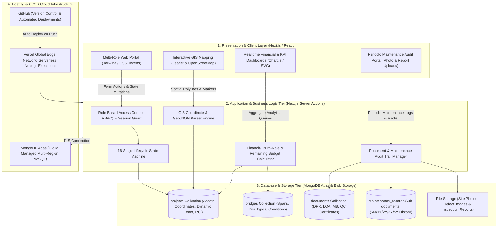
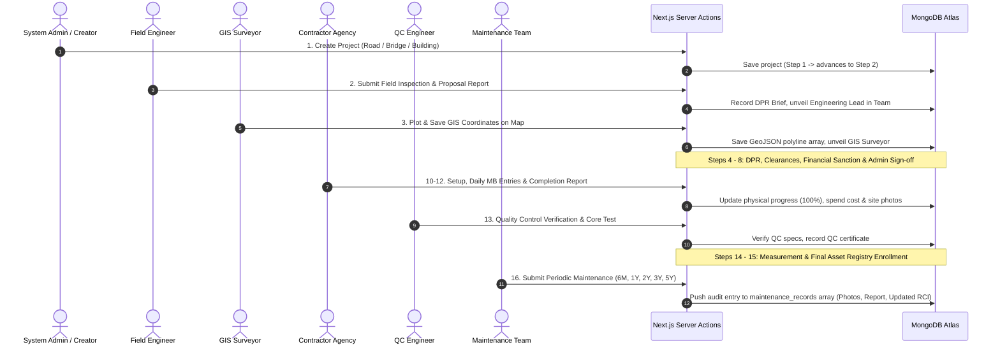

# 🏛️ High-Level Design (HLD) Document
## InfraTrack GIS — Infrastructure Lifecycle & Spatial Asset Governance Platform

---

## 1. System Overview & Objective
**InfraTrack GIS** is a full-stack, cloud-native platform designed to digitize the end-to-end governance of public infrastructure (Roads, Bridges, and Government Buildings). It unifies spatial GIS mapping, a 16-step strict stage-gate lifecycle workflow, dynamic team tracking, multi-department approvals, and 5-year periodic warranty maintenance.

---

## 2. High-Level Architecture Diagram

---

## 3. End-to-End Data Flow Sequence

---

## 4. Architectural Layer Breakdown

### Layer 1: Client & Presentation Tier
- **Framework**: Next.js 15 App Router with React Server Components (RSC) and interactive client wrappers.
- **GIS Engine**: `leaflet` & `react-leaflet` connected to OpenStreetMap vector tiles for road coordinate tracking and condition color-coding.
- **Dynamic Role Switcher**: Instant role toggle simulating 13 departmental actors (Admin, Engineer, GIS Surveyor, QC, Procurement, Maintenance, etc.).
- **Visual Design**: High-contrast modern UI tokens, responsive layouts, real-time KPI tiles.

### Layer 2: Business Logic & Application Tier
- **Server Actions**: Direct server-side data mutations ensuring zero client-side database credentials exposure.
- **Sequential Stage-Gate Engine**: Validates prerequisite step completion before allowing progression.
- **Dynamic Team Resolver**: Assembles the project's multi-disciplinary committee progressively as milestones are achieved.
- **Maintenance Audit Hub**: Allows repetitive periodic inspection submissions at Step 16 without resetting the project lifecycle.

### Layer 3: Persistence & Database Tier
- **Database**: MongoDB Atlas cloud cluster.
- **Collections Architecture**:
  - `projects`: Primary schema containing asset specifications, geometry, team registry, and maintenance history timeline.
  - `bridges`: Specific sub-asset records with span details, waterbodies, and scour condition ratings.
  - `documents`: Auditable repository of uploaded inspection orders, LOAs, DPRs, and test results.

### Layer 4: Infrastructure & Operations Tier
- **Hosting**: Vercel Serverless Platform with edge caching.
- **Continuous Integration**: GitHub automated repository triggers.
- **Database Connection Pooling**: Cached MongoDB connection client across hot serverless lambdas.

---

## 5. Non-Functional Requirements (NFRs)

| Metric | Target Specification | Implementation Approach |
| :--- | :--- | :--- |
| **Availability** | 99.9% Uptime | Multi-zone MongoDB Atlas replica set + Vercel Global Edge CDN. |
| **Response Latency**| $< 200\text{ ms}$ for dashboard queries | Indexed MongoDB queries + Next.js Server Component streaming. |
| **Security** | RBAC & Safe Uploads | Strict role gatekeeping and sanitized file storage handlers. |
| **Data Durability** | Zero Data Loss | Cloud automated continuous backups in MongoDB Atlas. |
| **Scalability** | Horizontal Serverless Scaling | Stateless Next.js functions scaling instantly with traffic spikes. |
